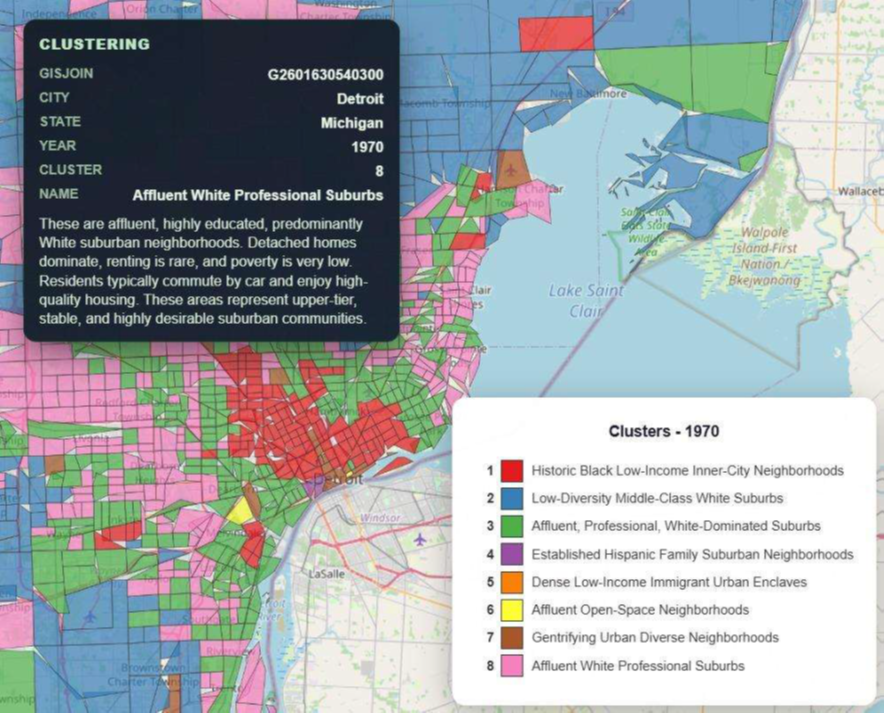
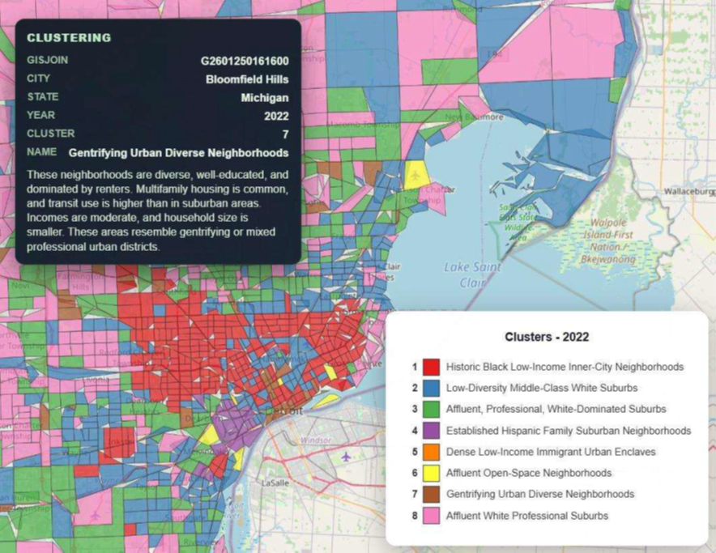

Census Forecast Map 🚀
=====================

## Visual Overview 👀
<p align="center">
  
</p>

<p align="center">
  
</p>

<p align="center">
  
  
</p>


Why You'll Like It ✨
--------------------
- 🔮 Two views: Predictions (any metric by year) and Clustering (macro_label by year).
- 🗺️ Pure client-side: CSV + GeoJSON only; Leaflet + Papa Parse handle the rest.
- 📊 Friendly UI: quick stats, legends, and hover/click info cards for fast insight.

Folder Tour 📂
-------------
- At a glance:
```
project-root/
├─ census_map.html           # Self-contained front-end (UI, logic, styling)
├─ run_map.py                # Tiny Python HTTP server that opens the map in your browser
└─ data/                     # Required data assets
   ├─ census_tracts.geojson  # Tract boundaries with a GISJOIN property
   ├─ predictions.csv        # Forecast metrics by tract and year
   └─ clustering.csv         # Cluster labels by tract and year
```

Quick Start ✅
-------------
### 1. Data Setup

Due to the large size of the datasets, they are not included in this repository.

Download all required data files from the link below:

👉 **Data download:** https://YOUR-DATA-LINK-HERE

### 2. Folder structure
After downloading and extracting the files, place them **relative to the project root** exactly as shown in the **Folder Tour** section above.


### 3. Launch a local server (recommended)
   ```bash
   python run_map.py
   ```
   - Opens http://localhost:8000/census_map.html in your default browser.
   - Keep the terminal open; stop with Ctrl+C when done.

   Alternative:
   ```bash
   python -m http.server 8000
   ```
   then open http://localhost:8000/census_map.html manually.

### 4. Direct file open (fallback)
   - Double-click census_map.html. If data fails to load due to browser file restrictions, use the server approach above.

Data Contracts 📑
-----------------
- census_tracts.geojson
  - FeatureCollection of census tracts.
  - Each feature must include a GISJOIN that matches the CSV rows.

- predictions.csv (tract-year rows)
  - Required keys: GISJOIN, YEAR
  - Typical metrics by theme:
    - People: Total Population, Average Household Income, Percent in Poverty, Percent with Bachelor's Degree or Higher
    - Housing: Average Home Value, Total Housing Units, Percent Rented, Percent Vacant, Percent Built 1939 or Earlier, Percent Single-Family Detached, Percent 5+ Unit Buildings
    - Demography: Percent White, Percent Black, Percent Hispanic, Percent Foreign Born
    - Household makeup: Percent Households with Children, Average Household Size
    - Commute: Average Commute Time, Percent Commute Work at Home, Percent Commute Public Transit, Percent Commute Drove Alone
  - Any additional metric columns are auto-detected and appear in the variable selector.

- clustering.csv
  - Expected headers: GISJOIN, YEAR, macro_label
  - Rows are tract-year pairs with the assigned cluster.

How It Works 🧠
--------------
- Loads GeoJSON boundaries, then joins CSV rows on GISJOIN for the selected year.
- Variable dropdown lists metrics (excluding GISJOIN/YEAR/cluster metadata); year slider switches snapshots.
- Choropleth coloring, legend, summary stats, and info cards update with each selection.

Troubleshooting 🛠️
-----------------
- 404 or failed fetch: start the server from the project root and verify the data/ files are present and named exactly.
- Empty map or red error badge: open browser devtools console for fetch/parse errors; confirm GISJOIN values align between CSV and GeoJSON.
- Stale data: hard refresh (Ctrl+Shift+R or Cmd+Shift+R) to clear cached CSV/GeoJSON.
